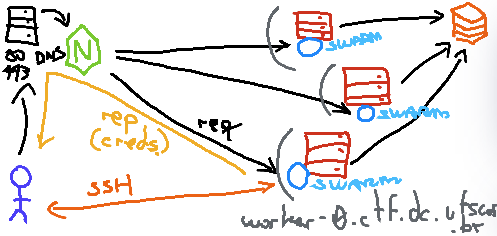

# CTF SECOMP UFSCar 2023 (SECOMPwn)


- https://apsdehal.in/awesome-ctf

- default credentials: `secomp:secomp`
- ctfd link: https://ctf.secompufscar.com.br

### INFRA:

The basic arquitecture looks something like this:


- https://ctfd.io
- https://registry.ctf.secompufscar.com.br
- https://registry-ui.ctf.secompufscar.com.br

```sh
docker login [OPTIONS] [SERVER]
docker tag SOURCE_IMAGE[:TAG] TARGET_IMAGE[:TAG]
docker push [OPTIONS] NAME[:TAG]
```

To run other architectures on docker emulate it

```sh
docker run --rm --privileged multiarch/qemu-user-static --reset -p yes
```

---

## Challs

### pwning

- chall 1: bash shellshock (CVE-2014-6271) [I Forgot to Update My Server]
- chall 2: crack-me not beautiful [Is it a Drug?]
- chall 3: BOF with Stack Canary [A Little Bird Lying In a Pile]
- chall 4: log4j/log4shell (CVE-2021-44228) [I am Logging Your Pc Now]

- chall 5: docker priv-esc (deprecated) [Ain't root, kkkrying]

### reversing / forense

- chall 1:
- chall 2:
- chall 3:

### web

- chall 1: Certificate
- chall 2: NoSQL Injection
- chall 3: SQL Injection
- chall 4: WordPress

### crypto

- chall 1: Gotta Go Fast
- chall 2: Hash Stuffing


